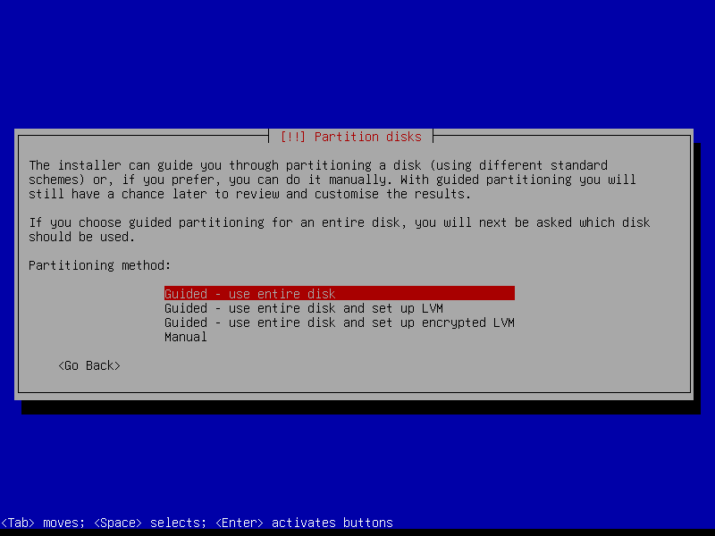
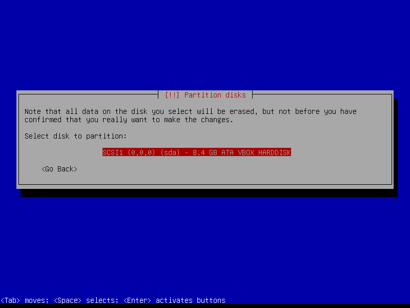
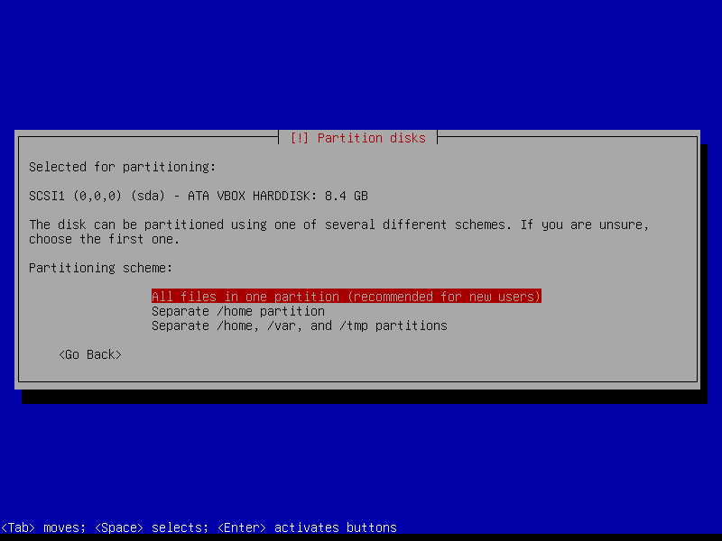
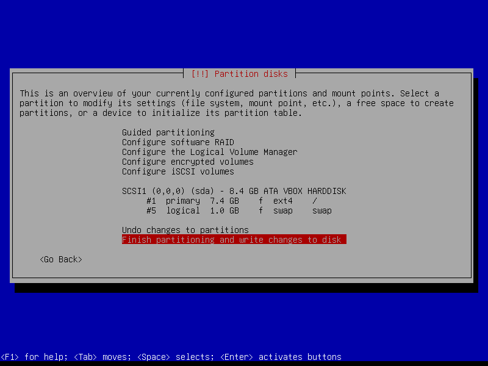
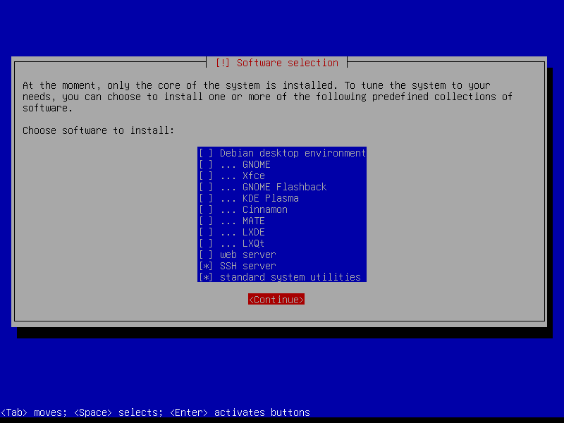
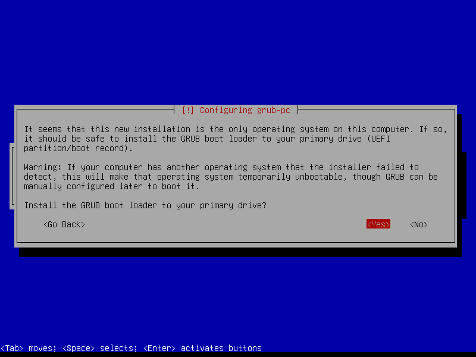
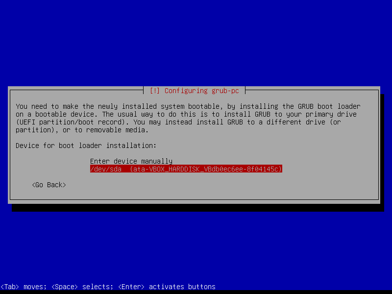

# pi-server-vm

A virtual Raspberry Pi lab environment for automated testing and deployment of containerized services — designed to behave like real Pi devices on the network.

🍀 **About**  
`pi-server-vm` is a toolset and framework to simulate realistic Raspberry Pi devices using VirtualBox VMs. It was created to support [PiSelfhosting](https://github.com/hvhoek/piselfhosting), an open source platform for managing and deploying Docker-based services across multiple Raspberry Pi systems.

Because real Pi devices can be slow to test, manage, or replicate, this project uses Debian-based VMs that mimic real Raspberry Pis on a network. This includes:

- Simulated Raspberry Pi MAC address OUIs  
- Consistent virtual serial numbers  
- Realistic network behavior using Bridge Mode  
- Easily reproducible and scriptable VM templates  
- Designed for manual use, Python-driven automation, and CI-based testing  

🛠️ **Project Structure**  
This project is designed in two layers:

- `pi-server-vm`: Provides generic Pi-like VMs for local network simulation.  
- `piselfhosting-vm-test`: Adds logic to test [PiSelfhosting](https://github.com/hvhoek/piselfhosting) installation and services on the PiVMs.

---

## 🚀 Setup (Quick Start)

1. **Clone the repo:**

   ```bash
   git clone https://github.com/your-org/pi-server-vm.git
   cd pi-server-vm
   ```

2. **Build master VM template:**

   ```bash
   python scripts/create_master_vm.py
   ```

   This sets up the base Debian VM in Bridge Mode with required configuration.

3. **Create a new PiVM clone:**

   ```bash
   python scripts/create_pivm.py --name pivm-1
   ```

   This clones the master VM and assigns it a simulated Raspberry Pi MAC address and virtual serial number.

4. **Start the VM:**

   You can start the VM manually in VirtualBox, or via:

   ```bash
   VBoxManage startvm pivm-1 --type headless
   ```

---

## 📁 Folder Structure

```
pi-server-vm/
├── scripts/                # Python scripts for VM automation
├── vm_templates/           # Base VM image configurations
├── docs/                   # Optional documentation files
└── README.md
```

---
## Installation Guide for the Master Template

This guide walks through the manual steps required to install Debian on the `pi-master-template` virtual machine.

### 1. Initial Setup

The script will automatically start the VM, and the Debian installer will boot. Proceed through the initial screens for:
- Language
- Location
- Keyboard Layout
- Network Configuration (should be automatic)
- Hostname (e.g., `pi-master-template`)
- Domain Name (can be left blank)
- Root Password (set a strong password)
- User Creation (create a user and password)

### 2. Disk Partitioning

When you reach the "Partition disks" step, follow this guided process. These choices will erase the virtual disk and set up a standard layout.

**Step 1: Choose Guided Method**  
Select **Guided - use entire disk**.
> 

**Step 2: Select the Disk**  
Select the only disk available, which will be the `VBOX HARDDISK`.
> 

**Step 3: Choose Partitioning Scheme**  
For simplicity, select **All files in one partition**.
> 

**Step 4: Finish and Write Changes**  
Review the proposed layout and select **Finish partitioning and write changes to disk**. Then, confirm **<Yes>** on the final confirmation screen to proceed.
> 

### 3. Software Selection (Critical Step)

This is the most important step for creating a minimal server. On the "Software selection" screen, ensure your choices match the image below. Use the spacebar to select/deselect items.

- **UNCHECK** `[ ] Debian desktop environment`
- **CHECK** `[X] SSH server`
- **CHECK** `[X] standard system utilities`

> 

### 4. GRUB Boot Loader Installation (Critical Step)

The GRUB bootloader allows the virtual machine to start.

**Step 1: Install GRUB**  
When asked to "Install the GRUB bootloader to the primary drive?", you must select **<Yes>**.
> 

**Step 2: Select the Boot Device**  
This is crucial. Do not choose "Enter device manually". You must select the virtual hard disk, which will be listed as `/dev/sda`.
> 

### 5. Finalizing the Installation

The installation will now complete. When you see the "Installation complete" message, you can select **<Continue>**. The virtual machine will reboot and then shut down (as it ejects the installation media).

Your `pi-master-template` is now ready! You can take a snapshot of it in VirtualBox to preserve its clean state before cloning.

### Verifying the VM Configuration

After you have created the `pi-master-template`, you can verify that the custom MAC address and unique serial number were assigned correctly.

There are two primary ways to check these settings: through the VirtualBox graphical user interface or via the command line.

#### Method 1: Using the VirtualBox GUI (Easiest)

1.  Open the VirtualBox Manager.
2.  Select the `pi-master-template` VM from the list.
3.  Click on **Settings**.

**To Check the MAC Address:**
- Navigate to the **Network** section.
- Select the **Adapter 1** tab.
- Click **Advanced** to expand the details.
- The **MAC Address** field will display the value. Verify that it begins with a Raspberry Pi prefix (e.g., `DCA632...` or `B827EB...`).

**To Check the Serial Number:**
- Navigate to the **General** section.
- Select the **Basic** tab.
- The **Description** field will contain the custom serial number, prefixed with `serial:`.

#### Method 2: Using the Command Line

Open your Windows Command Prompt (cmd) or PowerShell and use the following commands.

**To Check the MAC Address:**

    VBoxManage showvminfo pi-master-template | findstr "MAC"

*Expected output:*

    NIC 1:           MAC: DCA632A1B2C3, ...

**To Check the Serial Number:**

    VBoxManage showvminfo pi-master-template | findstr "serial"

*Expected output:*

    Description:     serial:1a2b3c4d5e6f7890


### Cloning the Master Template

Once you have a fully installed and configured `pi-master-template`, you can use it to create multiple, unique VM instances.

A script, `clone_vm.py`, is provided to automate this process. It handles cloning the VM and ensuring the new clone gets its own unique MAC address and serial number, just like real Raspberry Pi hardware.

#### Usage

To clone the template, run the script from your command line, providing a name for the new VM as an argument.

**Example:**
To create a new virtual machine named `pi-server-01`:

    python scripts/clone_vm.py pi-server-01

To create another one named `pi-web-server`:

    python scripts/clone_vm.py pi-web-server

After the script completes, you can start your new VM from the VirtualBox Manager or via the command line:

    VBoxManage startvm pi-server-01

## 🧪 Integration with PiSelfhosting

You can combine this with [`piselfhosting-vm-test`](https://github.com/your-org/piselfhosting-vm-test) to validate the deployment of services to simulated Raspberry Pi devices in CI or manual test environments.

---
### Security Configuration

This virtual machine template is configured with security best practices in mind.

#### Root Account is Locked

By default, the `root` user account is **locked**. This means you cannot log in directly as `root` or use `su` to become the root user. This is a deliberate security measure to prevent direct superuser access.

All administrative tasks **must** be performed using the `sudo` command by the `pivm` user.

#### Default User and First Login

- **Username:** `pivm`
- **Default Password:** `PivmPwd`

**IMPORTANT:** For security, you will be **forced to change this password** the very first time you log in as `pivm`. The system will not let you proceed until you have set a new, private password.
## 📜 License

This project is licensed under the MIT License.
