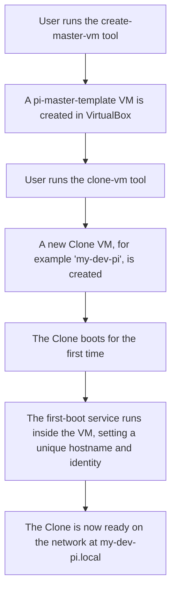

# Welcome to the Pi-Server-VM Documentation

This site contains the complete documentation for the Pi-Server-VM project.

## What is Pi-Server-VM?

Pi-Server-VM is a set of cross-platform tools to fully automate the creation and management of secure, minimal Debian virtual machines in Oracle VirtualBox. This project is designed to emulate a Raspberry Pi server environment, making it ideal for testing server software and network configurations without needing physical hardware.

This project is a core component of the PiSelfhosting ecosystem.

## Project Workflow

This diagram shows the core lifecycle of creating and using a virtual machine with this project.

## Getting Started

To get started, please use the navigation menu to find the detailed installation guide for your operating system.

-   For the easiest setup on Windows, please see the guide for our professional setup.exe installer.
-   For macOS and Linux users, the guides will walk you through setting up the command-line executables.
-   For advanced users, we also provide a pre-built .ova virtual appliance for an instant start on any platform.

## Contributing

We welcome contributions! If you would like to help improve the project, please see our detailed Contributing Guide in the navigation menu.
